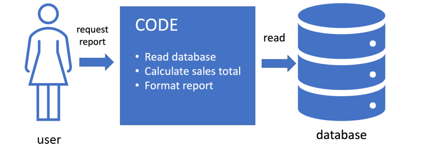
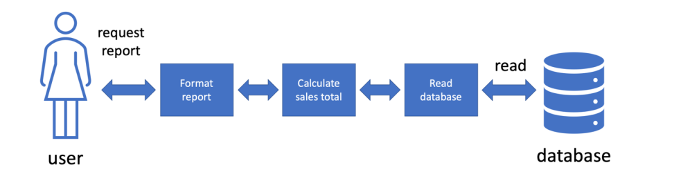
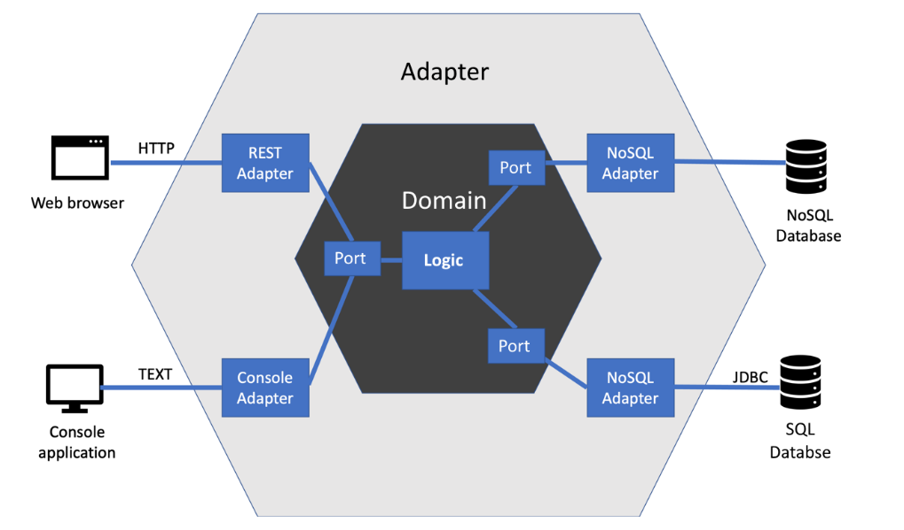
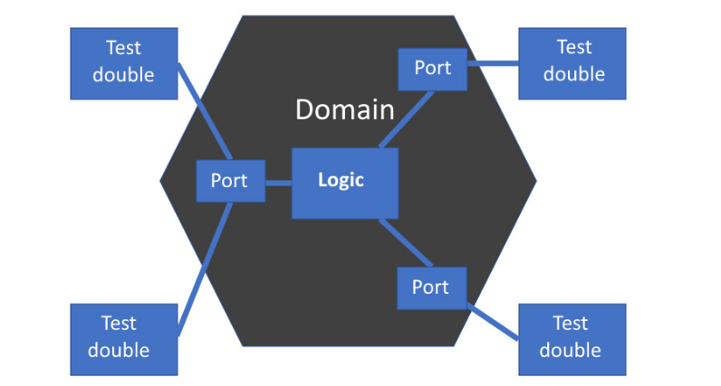

## Curso de desarrollo de software

Inicia un repositorio llamado CC-3S2 y dentro una carpeta llamada Actividades. Dentro de esta carpeta abre una carpeta llamada `Hexagonal` y coloca todas tus respuestas.Esta actividad es individual. 

Configurar la versión de gradle en esta actividad a una versión compatible del SDK.

En esta actividad, vamos a combinar todas esas técnicas en un poderoso enfoque de diseño conocido como arquitectura hexagonal. 

Con este enfoque, nos beneficiaremos al obtener más de la lógica de aplicación bajo pruebas unitarias y reducir la cantidad de pruebas de integración y de extremo a extremo requeridas. Construiremos una resistencia natural a los cambios fuera de la aplicación. 
Las tareas de desarrollo, como cambiar el proveedor de una base de datos, se simplificarán al tener menos lugares donde el código deba cambiarse. 

También podremos realizar pruebas unitarias en unidades más grandes, trayendo algunas pruebas que requieren pruebas de extremo a extremo en otros enfoques bajo pruebas unitarias.  

#### Los sistemas externos son difíciles  

Las dependencias de sistemas externos causan problemas en el desarrollo. La solución conduce a un buen enfoque de diseño. 

Veamos una forma sencilla de manejar sistemas externos. La tarea del usuario es extraer un informe de las ventas de este mes de una base de datos. 



#### Los problemas de entorno traen problemas  

El entorno en el que se ejecuta el software a menudo genera desafíos. 


**Problema:** Indica los problemas que puedan ocurrir debido al entorno.  


Una base de datos almacena datos, causando problemas para las pruebas. Supongamos que escribimos una prueba contra una base de datos de prueba, que comienza escribiendo un nombre de usuario de prueba. Si hemos ejecutado esta prueba antes, el nombre de usuario de la prueba ya estará almacenado en la base de datos. 

Por lo general, la base de datos informará un error de elemento duplicado y la prueba fallará.  

Las pruebas contra bases de datos necesitan limpieza. Todos los datos de prueba almacenados deben eliminarse después de que se hayan completado las pruebas. Si intentamos eliminar datos después de que la prueba haya tenido éxito, es posible que el código de eliminación nunca se ejecute si la prueba falla. 

Podríamos evitar esto eliminando siempre los datos antes de que se ejecute la prueba. Dichas pruebas serán lentas de ejecutar.  

Una tarea común en el software comercial es aceptar el pago de un cliente. Para eso, inevitablemente usamos un procesador de pago de terceros como PayPal o Stripe, como dos ejemplos. Además de los desafíos de la conectividad de la red, las API de terceros nos presentan desafíos adicionales:  

**Problema:** Enuncia algunos desafios que se presentan en este caso.

Existen muchos desafíos cuando mezclamos servicios externos y una sola pieza de código monolítica, lo que complica tanto el mantenimiento como las pruebas. 

**Pregunta:** ¿Qué podemos hacer al respecto para resolver o hacer que los sistemas externos sean más fáciles de manejar?.


#### Inversión de dependencia al rescate  

Aprendimos sobre el principio de inversión de dependencia anteriormente. Vimos que nos ayuda a aislar algún código que queríamos probar de los detalles de sus colaboradores. Notamos que era útil para probar cosas que se conectaban a sistemas externos que estaban fuera de el control. 

Vimos cómo el principio de responsabilidad única nos guió a dividir el software en tareas más pequeñas y más enfocadas.  

Aplicando estas ideas a el ejemplo anterior de informe de ventas, llegaríamos a un diseño mejorado, como se muestra en el siguiente diagrama:  



El diagrama anterior muestra cómo hemos aplicado los principios SOLID para dividir el código de informe de ventas. Hemos utilizado el principio de responsabilidad única para dividir la tarea general en tres tareas separadas:  

- Dar formato al informe
- Cálculo del total de ventas
- Lectura de los datos de ventas de la base de datos  

Esto ya hace que sea un poco más fácil trabajar con la aplicación.

Aquí también podemos aplicar el principio de inversión de dependencia. ¿Cómo?.

El mayor beneficio es que podemos intercambiar cualquier pieza de código que pueda acceder a cualquier base de datos, sin cambiar el código de cálculo. Por ejemplo, podríamos cambiar de una base de datos Postgres SQL a una base de datos Mongo NoSQL sin cambiar el código de cálculo. Podemos usar un doble de prueba para la base de datos para que podamos probar el código de cálculo como una prueba unitaria [FIRST](https://medium.com/@tasdikrahman/f-i-r-s-t-principles-of-testing-1a497acda8d6). 

Estas son ventajas muy significativas, no solo en términos de TDD y pruebas, sino también en términos de cómo se organiza el código. 

#### Generalizando este enfoque a la arquitectura hexagonal  

¿Podríamos extender este enfoque a toda la aplicación y obtener los mismos beneficios? ¿Podríamos encontrar una manera de separar toda la lógica de la aplicación y las representaciones de datos de las restricciones de la influencia externa? 

Ciertamente podemos y la forma general de este diseño se muestra en el siguiente diagrama:  

 

El diagrama anterior muestra lo que sucede cuando generalizamos el uso de la inversión de dependencia y la responsabilidad única para una aplicación completa. 

Se llama arquitectura hexagonal, también conocida como puertos y adaptadores por el término original utilizado por Alastair Cockburn, quien describió por primera vez este enfoque. 


#### Resumen de los componentes de la arquitectura hexagonal 

Para proporcionarnos este aislamiento de la lógica de aplicación central, la arquitectura hexagonal divide todo el programa en cuatro espacios:  

- Sistemas externos, incluidos navegadores web, bases de datos y otros servicios informáticos
- Los adaptadores implementan las API específicas requeridas por los sistemas externos
- Los puertos son la abstracción de lo que la aplicación necesita del sistema externo
- El modelo de dominio contiene la lógica de aplicación, libre de detalles de sistemas externos. 

El núcleo central de la aplicación es el modelo de dominio, rodeado por el soporte que necesita de sistemas externos.   

**Sistemas externos conectan los adaptadores**

Los sistemas externos son todas las cosas que viven fuera de la base de código. Incluyen cosas con las que el usuario interactúa directamente, como el navegador web y la aplicación de consola en el diagrama anterior. También incluyen almacenes de datos, como la base de datos SQL y la base de datos NoSQL. 

Otros ejemplos de sistemas externos comunes incluyen interfaces gráficas de usuario de escritorio, sistemas de archivos, API de servicios web descendentes y controladores de dispositivos de hardware. La mayoría de las aplicaciones necesitarán interactuar con sistemas como estos.  

En la arquitectura hexagonal, el núcleo del código de la aplicación no conoce ningún detalle sobre cómo se interactúa con los sistemas externos. La responsabilidad de comunicarse con sistemas externos se le da a una pieza de código conocida como **adaptador**.  

Los adaptadores encapsulan todo el conocimiento que el sistema necesita para interactuar con un sistema externo  y nada más. Los adaptadores tienen la única responsabilidad de saber cómo interactuar con un sistema externo. Si ese sistema externo cambia su interfaz pública, solo el adaptador deberá cambiar.  

**Los adaptadores se conectan a los puertos**

Los puertos son parte del modelo de dominio. Abstraen los detalles del intrincado conocimiento del adaptador de su sistema externo. Los puertos responden a una pregunta ligeramente diferente: ¿para qué necesitamos ese sistema externo? 

Los puertos usan el principio de Inversión de Dependencia para aislar el código de dominio de conocer cualquier detalle sobre los adaptadores. Están escritos puramente en términos de el modelo de dominio.

Dado el ejemplo de informe de ventas anterior, el puerto de comandos incluiría una forma de solicitar un informe de ventas. En el código, podría verse tan simple como esto: 

```
package com.sales.domain; 
import java.time.LocalDate; 
public interface Commands { 
    SalesReport calculateForPeriod(LocalDate start, 
       LocalDate end); 
} 
```

Este fragmento de código presenta lo siguiente:  

- Sin referencias a `HttpServletRequest` ni nada que ver con HTTP
- Sin referencias a formatos JSON
- Referencias a el modelo de dominio: `SalesReport` y `java.time.LocalDate`.
- El modificador de acceso `públic`, por lo que se puede llamar desde el adaptador REST. 

Esta interfaz es un puerto. Nos brinda una forma general de obtener un informe de ventas de la aplicación. 

**Los puertos se conectan a el modelo de dominio**

El modelo de dominio representa las cosas que los usuarios quieren hacer, en código. Cada historia de usuario se describe mediante un código aquí. 
Idealmente, el código de esta capa utiliza el lenguaje del problema que estamos resolviendo, en lugar de detalles tecnológicos. 

Cuando hacemos esto bien, este código describe acciones que preocupan a los usuarios en los términos que nos han contado.

En el centro de toda la aplicación se encuentra el modelo de dominio. Contiene la lógica que da vida a las historias de los usuarios.  

Contiene código que describe cómo se resuelve el problema del usuario. Esta es la lógica esencial de la aplicación que crea valor empresarial.  

**La regla de oro** : el dominio nunca se conecta directamente a los adaptadores.

A partir de esto podemos tomar dos decisiones estructurales de alto nivel:  

- El modelo de dominio vive en un paquete de dominio (y subpaquetes)
- Los adaptadores viven en un paquete de adaptadores (y subpaquetes)  

Las herramientas de análisis estático como [SonarQube](https://docs.sonarqube.org/latest/) pueden automatizar las comprobaciones de importación como parte del proceso de construcción.  

#### Las reglas de oro de la arquitectura hexagonal  

- El modelo de dominio nunca se conecta directamente a nada en la capa del adaptador para que la lógica de la aplicación no dependa de los detalles de los sistemas externos.
- Los adaptadores se conectan a los puertos para aislar el código que se conecta a los sistemas externos.
- Los puertos son parte del modelo de dominio para crear abstracciones de sistemas externos.
- El modelo de dominio y los adaptadores dependen únicamente de los puertos. Esta es la inversión de dependencia en el trabajo.  

Estas reglas simples mantienen el diseño en línea y preservan el aislamiento del modelo de dominio.  

### Abstracción del sistema externo  

Tomaremos un enfoque paso a paso para manejar sistemas externos, donde primero decidiremos qué necesita el modelo de dominio, luego resolveremos las abstracciones correctas que ocultan sus detalles técnicos. 

Consideraremos dos sistemas externos comunes: solicitudes web y acceso a bases de datos.  

#### Decidir qué necesita el modelo de dominio

 El lugar para comenzar el diseño es con el modelo de dominio. Necesitamos diseñar un puerto adecuado para que el modelo de dominio interactúe. Este puerto debe estar libre de cualquier detalle de el sistema externo y al mismo tiempo, debe responder a la pregunta de para qué la aplicación necesita este sistema. Estamos creando una abstracción. 

Pero hay varios tipos comunes de abstracciones que usaremos. Esto se debe a que se utilizan tipos comunes de sistemas externos al crear una aplicación web típica. La primera y más obvia es la conexión a la propia web. En la mayoría de las aplicaciones, encontraremos algún tipo de almacén de datos, normalmente un sistema de base de datos de terceros. 

Para muchas aplicaciones, también llamaremos a otro servicio web. A su vez, este servicio podrá llamar a otros en una flota de servicios, todos internos de la empresa. Otra llamada de servicio web típica es a un proveedor de servicios web de terceros, como un procesador de pagos con tarjeta de crédito, por ejemplo.  

Veamos formas de abstraer estos sistemas externos comunes.  

**Abstracción de solicitudes y respuestas web**  

La aplicación responderá a las solicitudes y respuestas HTTP. El puerto que necesitamos diseñar representa la solicitud y la respuesta en términos de el modelo de dominio, eliminando la tecnología web. 

El ejemplo de informe de ventas podría presentar estas ideas como dos objetos de dominio simples. Estas solicitudes se pueden representar mediante una clase `RequestSalesReport`:  

```
package com.sales.domain; 
import java.time.LocalDate; 
public class RequestSalesReport {

    private final LocalDate start; 
    private final LocalDate end; 
    public RequestSalesReport(LocalDate start, 
                              LocalDate end){ 
        this.start = start; 
        this.end = end; 
    } 
    public SalesReport produce(SalesReporting reporting) { 
        return reporting.reportForPeriod(start, end); 
    } 
} 
```

Aquí, podemos ver las piezas críticas de el modelo de dominio de la solicitud:  

- Lo que estamos solicitando, es decir, un informe de ventas, capturado en el nombre de la clase
- Los parámetros de esa solicitud, es decir, las fechas de inicio y finalización del período del informe.  

Podemos ver cómo se representa la respuesta:  

- La clase `SalesReport` contendrá la información sin procesar solicitada.  

También podemos ver lo que no está presente:  

- Los formatos de datos utilizados en la solicitud web
- Códigos de estado HTTP, como 200 OK
- `HTTPServletRequest` y `HttpServletResponse` u objetos de marco equivalentes.  

Esta es una representación de modelo de dominio puro de una solicitud de informe de ventas entre dos fechas. No hay indicios de que esto haya venido de la web, un hecho que es muy útil ya que podemos solicitarlo desde otras fuentes de entrada, como una GUI de escritorio o una línea de comandos. 

Aún mejor, podemos crear estos objetos de modelo de dominio muy fácilmente en una prueba unitaria.  

**Abstrayendo la base de datos**  

En una arquitectura hexagonal, comenzamos diseñando el puerto con el que interactuará el modelo de dominio, de nuevo en términos de dominio puro. La forma de crear una abstracción de base de datos es pensar en qué datos se deben almacenar y no en cómo se almacenarán.  

Un puerto de base de datos tiene dos componentes:  

- Una interfaz para invertir la dependencia de la base de datos.
- La interfaz a menudo se conoce como repositorio y  tiene la función de aislar el modelo de dominio de cualquier parte de la base de datos y su tecnología de acceso.
- Objetos de valor que representan los datos en sí mismos, en términos de modelo de dominio.  

Existe un objeto de valor para transferir datos de un lugar a otro. Dos objetos de valor que contienen los mismos valores de datos se consideran iguales. Son ideales para transferir datos entre la base de datos y el código.  

Volviendo a el ejemplo de informe de ventas, un posible diseño para el repositorio sería este: 

```
package com.sales.domain; 
public interface SalesRepository { 
    List<Sale> allWithinDateRange(LocalDate start, 
                                  LocalDate end); 
} 
```

Aquí, tenemos un método llamado `allWithinDateRange()` que nos permite obtener un conjunto de transacciones de ventas individuales que se encuentran dentro de un rango de fechas particular. 
Los datos se devuelven como `java.util.List` de objetos de valor `Sale`.  Estos son objetos de modelo de dominio con todas las funciones. 

Es posible que tengan métodos que realicen parte de la lógica de la aplicación crítica. Pueden ser poco más que estructuras de datos básicas, tal vez utilizando una estructura `record` de Java 17. Esta elección es parte de el trabajo al decidir cómo se ve un diseño bien diseñado en el caso específico.  

Nuevamente, podemos ver lo que no está presente:  

- Cadenas de conexión de base de datos
- Detalles de la API de JDBC o JPA: la biblioteca estándar de conectividad de bases de datos de Java
- Consultas SQL (o consultas NoSQL)
- Esquema de base de datos y nombres de tablas
- Detalles del procedimiento almacenado en la base de datos  

El diseño de repositorio se centran en lo que el modelo de dominio necesita que proporcione la base de datos, pero no restringe la forma en que lo proporciona. Como resultado, se deben tomar algunas decisiones interesantes al diseñar el repositorio, con respecto a cuánto trabajo ponemos en la base de datos y cuánto hacemos en el propio modelo de dominio. 

Ejemplos de esto incluyen decidir si escribiremos una consulta compleja en el adaptador de base de datos o si escribiremos consultas más simples y realizaremos trabajo adicional en el modelo de dominio. Asimismo, ¿haremos uso de procedimientos almacenados en la base de datos?. 

Cualesquiera que sean las compensaciones que decidamos en estas decisiones, una vez más, el adaptador de la base de datos es donde residen todas esas decisiones. El adaptador es donde vemos las cadenas de conexión de la base de datos, las cadenas de consulta, los nombres de las tablas, etc. El adaptador encapsula los detalles de diseño de el esquema de datos y tecnología de base de datos. 

**Abstracción de llamadas a servicios web** 

Hacer llamadas a otros servicios web es una tarea de desarrollo frecuente. Los ejemplos incluyen llamadas a procesadores de pagos y servicios de búsqueda de direcciones. 

A veces, estos son servicios externos de terceros y, a veces, viven dentro de la flota de servicios web. De cualquier manera, generalmente requieren que se realicen algunas llamadas HTTP desde la aplicación.  

La abstracción de estas llamadas procede de manera similar a la abstracción de la base de datos. El puerto se compone de una interfaz que invierte la dependencia del servicio web al que llamamos y algunos objetos de valor que transfieren datos.  

Un ejemplo de abstracción de una llamada a una API de mapeo como Google Maps, por ejemplo, podría verse así:  

```
package com.sales.domain; 
public interface MappingService { 
   void addReview(GeographicLocation location, 
                   Review review); 
} 
```

Tenemos una interfaz que representa a `MappingService` como un todo. Hemos agregado un método para agregar una revisión de una ubicación en particular en cualquier proveedor de servicios que terminemos usando. 

Usamos `GeographicLocation` para representar un lugar. Bien puede tener un par de latitud y longitud o puede estar basado en un código postal. Esa es otra decisión de diseño. Nuevamente, no vemos ninguna señal del servicio de mapas subyacente o sus detalles de API. Ese código vive en el adaptador, que se conectaría al servicio web de mapeo externo real.  

Esta abstracción nos ofrece beneficios al poder usar un doble de prueba para ese servicio externo y poder cambiar de proveedor de servicios en el futuro. 

Nunca se sabe cuándo un servicio externo podría cerrarse o volverse demasiado costoso de usar. Es bueno mantener las opciones abiertas usando la arquitectura hexagonal. 

### Escribir el código de dominio  

Aqui veremos algunas de las cosas en las que debemos pensar mientras escribimos el código para el modelo de dominio. Cubriremos qué tipos de bibliotecas debemos y no debemos usar en el modelo de dominio, cómo tratamos la configuración y la inicialización de la aplicación y también pensaremos en el impacto que tienen los frameworks de trabajo populares.  

**Decidir lo que debería estar en el modelo de dominio** 

 Aplicando la arquitectura hexagonal, elegimos el modelo de dominio para que sea independiente de aquellas cosas que no son esenciales para resolver el problema. Es por eso que los sistemas externos están aislados. 

Teniendo en cuenta esta restricción, podemos tomar cualquier enfoque estándar de análisis y diseño. Somos libres de elegir objetos o descomponerlos en funciones como lo hacemos normalmente. Solo tenemos que preservar esa distinción entre la esencia del problema y los detalles de implementación.  

**Uso de bibliotecas y frameworks en el modelo de dominio** 

El modelo de dominio puede usar cualquier biblioteca o frameworks escrito previamente para ayudar a hacer tu trabajo. Sin embargo, debemos ser conscientes de los frameworks que nos unen al mundo de los sistemas externos y la capa de adaptador. 

Necesitamos invertir las dependencias en esos frameworks, dejándolos ser solo un detalle de implementación de la capa del adaptador.  

**Decidir sobre un enfoque de programación**  

El modelo de dominio se puede escribir utilizando cualquier paradigma de programación. Esta flexibilidad significa que tendremos que decidir qué enfoque utilizar. Esta nunca es una decisión puramente técnica, como tantas cosas en el software. Debemos considerar lo siguiente:  

- Habilidades y preferencias existentes del equipo: ¿Qué paradigma conoce mejor el equipo? ¿Qué paradigma les gustaría usar, dada la oportunidad?
- Bibliotecas, frameworks y bases de código existentes: si vamos a utilizar código preescrito – y seamos realistas, es casi seguro que lo haremos – entonces, ¿qué paradigma se adaptaría mejor a ese código?
- Guías de estilo y otros mandatos de código: ¿Estamos trabajando con una guía de estilo o paradigma existente? Si nos pagan por el trabajo, o estamos contribuyendo a un proyecto de código abierto existente – tendremos que adoptar el paradigma que se nos ha propuesto.  

La buena noticia es que cualquiera que sea el paradigma que elijamos, podremos escribir el modelo de dominio con éxito. Si bien el código puede tener un aspecto diferente, se puede escribir una funcionalidad equivalente utilizando cualquiera de los paradigmas.  

### Sustitución de dobles de prueba por sistemas externos  

Discutiremos una de las mayores ventajas que la arquitectura hexagonal aporta a TDD: alta capacidad de prueba. También trae algunas ventajas de flujo de trabajo.  

**Sustitución de los adaptadores por dobles de prueba**

La ventaja clave que la arquitectura hexagonal aporta a TDD es que es trivialmente fácil reemplazar todos los adaptadores con dobles de prueba, lo que nos brinda la capacidad de probar todo el modelo de dominio con pruebas de unidades FIRST. 
 
Podemos probar toda la lógica central de la aplicación sin entornos de prueba, bases de datos de prueba o herramientas HTTP como Postman o curl, solo pruebas unitarias rápidas y repetibles. La configuración de prueba se ve así:  

  

Podemos ver que todos los adaptadores han sido reemplazados por dobles de prueba, liberándonos completamente de el entorno de sistemas externos. 

Las pruebas unitarias ahora pueden cubrir todo el modelo de dominio, lo que reduce la necesidad de pruebas de integración. 

Obtenemos varios beneficios al hacer esto:  

- Podemos escribir pruebas TDD primero con facilidad
- Obtenemos los beneficios de la prueba de la unidad FIRST
- Libera a el equipo

Una consecuencia de poder probar todo el modelo de dominio es que podemos aplicar TDD y  pruebas unitarias FIRST  a unidades de programa mucho más grandes. La siguiente sección analiza lo que eso significa para nosotros.  

#### Pruebas unitarias de unidades más grandes  

Podemos probar unidades que son tan grandes como una historia de usuario.  

El enfoque combinado de diseño con arquitectura hexagonal y comportamientos de prueba en lugar de detalles de implementación conduce a un sistema de capas interesante. En lugar de tener capas tradicionales, como podríamos tener en una arquitectura de tres niveles, tenemos círculos de comportamiento de nivel cada vez más alto. 

Dentro de el modelo de dominio, encontraremos esas pruebas en pequeño. Pero a medida que nos movemos hacia afuera, hacia la capa adaptadora, encontraremos unidades de comportamiento más grandes.  

**Pruebas unitarias de historias de usuario completas**  

Los puertos en el modelo de dominio forman un límite natural de alto nivel del modelo de dominio. Si repasamos lo que hemos aprendido, veremos que este límite consiste en lo siguiente:  

- La esencia de las solicitudes de los usuarios.
- La esencia de una respuesta de la aplicación
- La esencia de cómo se necesita almacenar y acceder a los datos
- Todo utilizando código libre tecnología  

Esta capa es la esencia de lo que hace la aplicación, libre de los detalles de cómo lo hace. Es nada menos que las propias historias de usuario originales. 

Lo más significativo de este modelo de dominio es que podemos escribir pruebas de  unidad FIRST. Tenemos todo lo que necesitamos para reemplazar los sistemas externos difíciles de probar con simples dobles de prueba. 

Podemos escribir pruebas unitarias que cubran historias de usuario completas, lo que confirma que la lógica central es correcta.  

**Pruebas más rápidas y fiables** 

La arquitectura hexagonal permite que las pruebas unitarias reemplacen algunas de estas pruebas de integración, acelerando las compilaciones y brindando una mayor repetibilidad de las pruebas. 


Ahora podemos hacer una prueba de manejo en tres granularidades contra el modelo de dominio:  

- Contra un solo método o función
- Contra los comportamientos públicos de una clase y de sus colaboradores.
- Contra la lógica central de toda una historia de usuario  

Este es un gran beneficio de la arquitectura hexagonal. El aislamiento de los servicios externos tiene el efecto de empujar la lógica esencial de una historia de usuario al modelo de dominio, donde interactúa con los puertos. 

Como hemos visto, esos puertos por diseño, son trivialmente fáciles de escribir dobles de prueba. 

A medida que cubrimos amplias áreas de funcionalidad con pruebas unitarias, desdibujamos la línea entre integración y prueba unitaria. Eliminamos el trabajo de los desarrolladores que prueban más historias de usuarios al hacer que la prueba sea más fácil. 

El uso de más pruebas unitarias mejora los tiempos de compilación, ya que las pruebas se ejecutan rápidamente y brindan un aprobado/fallido confiable. 

Se necesitan menos pruebas de integración, lo cual es bueno ya que se ejecutan más lentamente y son más propensas a obtener resultados incorrectos.  

### Wordz: abstracción de la base de datos  

En esta sección, aplicaremos lo que hemos aprendido a nuestra aplicación Wordz y crearemos un puerto adecuado para obtener las palabras para presentarlas a un usuario.   

El primer trabajo en el diseño del puerto es decidir qué debería estar haciendo. 

Para un puerto de base de datos, debemos pensar en la división entre lo que queremos del modelo de dominio y lo que enviaremos a la base de datos. 

Los puertos que usamos para una base de datos generalmente se denominan **interfaces de repositorio**.  

Tres principios generales deben guiarnos:  

- Piensa en lo que necesita el modelo de dominio: ¿por qué necesitamos estos datos? ¿Para qué será utilizado?
- No te limites a hacer eco de una implementación de base de datos supuesta
- Considera cuándo deberíamos aprovechar más el motor de la base de datos. 

Para la aplicación de ejemplo consideremos la tarea de buscar una palabra al azar para que el usuario la adivine. ¿Cómo debemos dividir el trabajo entre el dominio y la base de datos? 

Hay dos amplias opciones:  

- Sea que la base de datos elija una palabra al azar
- Sea que el modelo de dominio genera un número aleatorio y sea que la base de datos suministre una palabra numerada.  

Tambien podemos tomar otra decisión de diseño aquí. Los números utilizados para identificar una palabra comenzarán en 1 y aumentarán en uno por cada palabra. 

Podemos proporcionar un método en el puerto que devuelva el límite superior de estos números. Luego, estamos listos para definir esa interfaz de repositorio, con una prueba.  

La clase de prueba comienza con la declaración del paquete y las importaciones de biblioteca que necesitamos. 

**Tarea:** Implementa y comprueba el uso del siguiente código: 


```
package com.wordz.domain; 
import org.junit.jupiter.api.BeforeEach; 
import org.junit.jupiter.api.Test; 
import org.junit.jupiter.api.extension.ExtendWith; 
import org.mockito.Mock;
import org.mockito.MockitoAnnotations;
import static org.assertj.core.api.Assertions.*;
import static org.mockito.Mockito.when;
```

Habilita la integración de Mockito con una anotación proporcionada por la biblioteca `junit-jupiter`. Añade la anotación a nivel de clase:  

```
@ExtendWith(MockitoExtension.class) 
public class WordSelectionTest { 
```

Define algunas constantes enteras para la legibilidad: 

```
private static final int HIGHEST_WORD_NUMBER = 3; 
private static final int WORD_NUMBER_SHINE = 2;  
```

Necesitas dos dobles de prueba, que queremos que Mockito genere. Necesitas un stub para el repositorio de palabras y un stub para un generador de números aleatorios.
Debes agregar campos para estos stubs. Marca los campos con la anotación Mockito `@Mock` para que Mockito  genere los dobles:  

```
@Mock 
private WordRepository repository; 
 @Mock 
private NumerosAleatorios random; 
```

Llama al método de prueba `selectsWordAtRandom()`. Explica lo que hace en el código siguiente:

```
@Test 
    void selectsWordAtRandom() { 
        when(repository.highestWordNumber()) 
            .thenReturn(HIGHEST_WORD_NUMBER); 
when(repository.fetchWordByNumber(WORD_NUMBER_SHINE)) 
            .thenReturn("SHINE"); 
        when(random.next(HIGHEST_WORD_NUMBER)) 
            .thenReturn(WORD_NUMBER_SHINE); 
        var selector = new WordSelection(repository, 
                                         random); 
        String actual = selector.chooseRandomWord(); 
        assertThat(actual).isEqualTo("SHINE"); 
    } 
} 
```
Explica el funcionamiento de la clase `WordSelection`, de `WordRepository`, de `Numeros aleatorios` y el método `chooseRandomWord()` y de los siguientes códigos:

```
@BeforeEach 
void beforeEachTest() { 
    when(repository.highestWordNumber()) 
                  .thenReturn(HIGHEST_WORD_NUMBER); 
    when(repository.fetchWordByNumber(WORD_NUMBER_SHINE)) 
                  .thenReturn("SHINE"); 
} 
```

```
package com.wordz.domain; 
public interface WordRepository { 
    String fetchWordByNumber(int number); 
    int highestWordNumber(); 
} 
```

La prueba también revisa la interfaz necesaria para el generador de números aleatorios:  

```
package com.wordz.domain; 
public interface NumerosAleatorios{ 
    int next(int upperBoundInclusive); 
}
```

El método `next()` devuelve int en el rango de 1 al número `upperBoundInclusive`. 

Con las interfaces de prueba y puerto definidas, podemos escribir el código del modelo de dominio: 

```
package com.wordz.domain; 
public class WordSelection { 
    private final WordRepository repository; 
    private final NumerosAleatorios random; 
    public WordSelection(WordRepository repository, 
                         NumerosAleatorios random) {

        this.repository = repository; 
        this.random = random; 
    } 
    public String chooseRandomWord() { 
          int wordNumber = 
           random.next(repository.highestWordNumber()); 
        return repository.fetchWordByNumber(wordNumber); 
    } 
} 
```
Con esto, el código de producción para el modelo de dominio de `WordSelection` está completo.  


