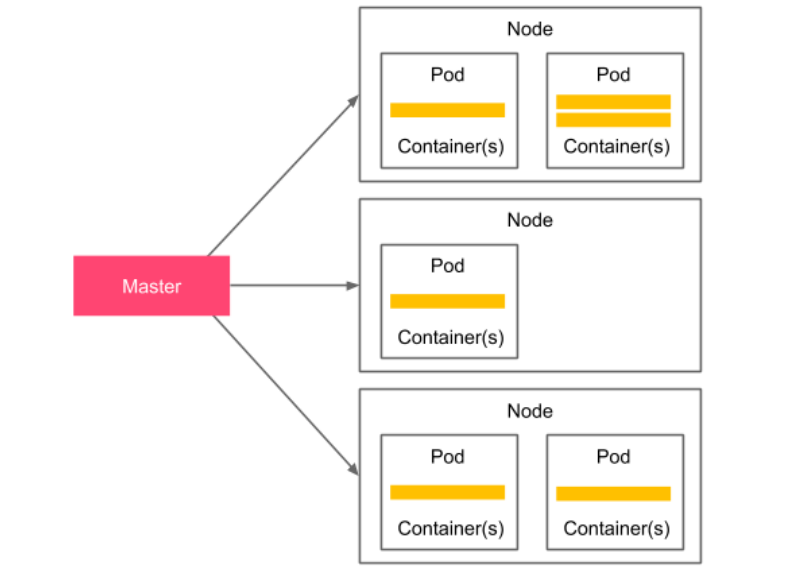

## Curso de desarrollo de software

**Indicaciones**

Inicia un repositorio llamado CC-3S2 y dentro una carpeta llamada Actividades. Dentro de esta escribe una carpeta llamada `Kubernetes` y coloca todas tus respuestas.

Esta actividad es individual.


### Introducción a la clustering de servidores  

Un clúster de servidores es un conjunto de computadoras conectadas que funcionan juntas de tal manera que se pueden usar de manera similar a un solo sistema. 
Los servidores suelen estar conectados a través de la red local mediante una conexión lo suficientemente rápida para garantizar que los servicios que se ejecutan se distribuyan. 

Un clúster de servidor simple se presenta en el siguiente diagrama:  


Un usuario accede al clúster a través de un host maestro, que expone la API del clúster. 

Existen múltiples nodos que actúan como recursos informáticos, lo que significa que son los encargados de ejecutar las aplicaciones.

El maestro, por otro lado, es responsable de todas las demás actividades, como el proceso de orquestación, el descubrimiento de servicios, el equilibrio de carga y la detección de fallas de nodos.  

### Introducción a Kubernetes 

[Kubernetes](https://kubernetes.io/es/) es un sistema de administración de clústeres de código abierto que fue diseñado originalmente por Google. 
La popularidad de Kubernetes ha crecido tanto recientemente que usar Kubernetes es el enfoque recomendado y mantener las herramientas nativas de Docker como alternativa. 

El siguiente gráfico muestra la arquitectura simplificada de Kubernetes: 



El plano de control de Kubernetes (maestro), que en realidad es un conjunto de servicios de clúster, es responsable de hacer cumplir el estado deseado de tus aplicaciones. 
En otras palabras, especifica la configuración de implementación de manera declarativa (cuatro réplicas de un servicio web que expone el puerto 8080) y el plano de control 
es responsable de que esto suceda. 

Un nodo de Kubernetes, por otro lado, es un trabajador. Puedes verlo simplemente como un host de docker con un proceso especial de Kubernetes (llamado kubelet) instalado.  

Desde la perspectiva del usuario, proporciona una configuración de implementación declarativa en forma de archivo YAML y la pasa al plano de control de Kubernetes a través de su API. 
Luego, el plano de control lee la configuración e instala la implementación. 

Kubernetes introduce el concepto de **Pod**, que representa una única unidad de implementación. El Pod contiene contenedores Docker, que se programan juntos. 
Si bien puedes colocar varios contenedores en un solo Pod, en escenarios reales, verás que la mayoría de los Pods contienen solo un contenedor Docker. 

Los pods se crean y eliminan dinámicamente según los cambios de requisitos que se expresan en las actualizaciones de configuración de YAML.  

#### Descripción general de las características de Kubernetes 

Kubernetes proporciona una serie de características interesantes. Repasemos los más importantes: 

- Equilibrio de contenedores
- Equilibrio de carga de tráfico
- Escalamiento horizontal dinámico
- Recuperación de fallas
- Actualizaciones continuas
- Orquestación de almacenamiento
- Detección de servicios
- Ejecutar en todas partes

### Instalación de Kubernetes  

Kubernetes, al igual que Docker, consta de dos partes: el cliente y el servidor. 

Obviamente, para hacer cualquier cosa con Kubernetes, necesitamos ambas partes, así que describámoslas una por una, comenzando con el cliente.  

#### Cliente de Kubernetes  

El cliente de Kubernetes, `kubectl`,  es una aplicación de línea de comandos que te permite realizar operaciones en el clúster de Kubernetes. 

El proceso de instalación depende de tu sistema operativo. 

Puedes consultar los detalles en el sitio web oficial de Kubernetes: https://kubernetes.io/docs/tasks/tools/. 

Una vez que haya instalado correctamente kubectl , deberías poder ejecutar el siguiente comando:  

```
$ kubectl version --client 
```

Ahora que tienes configurado el cliente de Kubernetes, podemos pasar al servidor.  

#### Servidor de Kubernetes 


Hay varias formas de configurar un servidor de Kubernetes. Si eres completamente nuevo en Kubernetes, se recomienda comenzar desde un entorno local.  

**Entorno local**  

Aunque Kubernetes en sí mismo es un sistema de clústeres complejo, existen algunas herramientas que pueden simplificar tu configuración de desarrollo local. Repasemos las opciones que tiene, que incluyen `Docker Desktop`, `kind` y `minikube`.  

**Docker Desktop**  

[Docker Desktop](https://www.docker.com/products/docker-desktop/), es una aplicación que se utiliza para configurar un entorno Docker local en macOS o Windows. 

Como se sabe, el demonio Docker solo puede ejecutarse de forma nativa en Linux, por lo que para otros sistemas operativos, se debe ejecutarlo en una máquina virtual.

Docker Desktop proporciona una forma súper intuitiva de hacer esto y, afortunadamente, también admite la creación de clústeres de Kubernetes. 

Si tienes instalado Docker Desktop, todo lo que necesitas hacer es marcar la casilla `Enable Kubernetes` en la interfaz de usuario.  

A partir de aquí, se iniciará el clúster de Kubernetes y se configurará kubectl y se estará listo para usar el clúster de Kubernetes.  

**Kind** 

Si usas el sistema operativo Linux y no puedes, o simplemente no quieres, usar Docker Desktop, entonces tu segunda opción más simple es [kind](https://kind.sigs.k8s.io/) (abreviatura de Kubernetes in Docker). Es una herramienta para la que el único requisito es tener Docker instalado y configurado.  

Después de instalar kind, puedes iniciar y configurar tu clúster local de Kubernetes con este único comando:  

```
$ kind create cluster 
```

**Nota:** Puedes consultar los pasos de instalación de kind en https://kind.sigs.k8s.io/docs/user/quick-start/.  

**minikube**  

[minikube](https://kubernetes.io/es/docs/tutorials/hello-minikube/), es una herramienta de línea de comandos que inicia un entorno de Kubernetes completamente funcional dentro de una máquina virtual. Está respaldado por un hipervisor de VM, por lo que debe tener instalado VirtualBox, Hyper-V, VMware o una herramienta similar. 

Las instrucciones para instalar minikube dependen de tu sistema operativo, y puedes encontrar instrucciones para cada uno en https://minikube.sigs.k8s.io/docs/start/.  

 minikube es una herramienta de código abierto que se puede encontrar en GitHub en https://github.com/kubernetes/minikube. 
 
 Una vez que haya instalado correctamente minikube, puedes iniciar tu clúster de Kubernetes con el siguiente comando:  

```
$ minikube start 
```
 
minikube inicia un clúster de Kubernetes y configura automáticamente el cliente de Kubernetes con la URL y las credenciales del clúster. 

#### Plataformas en la nube 

Kubernetes se ha vuelto tan popular que la mayoría de las plataformas de computación en la nube lo brindan como un servicio. 

[Google Cloud Platform](https://cloud.google.com/?hl=es-419) (GCP), que te permite crear un clúster de Kubernetes en unos minutos. Otras plataformas en la nube, como [Microsoft Azure](https://azure.microsoft.com/es-es), [Amazon Web](https://aws.amazon.com/es/) Services (AWS) e [IBM Cloud](https://cloud.ibm.com/login), también tienen Kubernetes . .  

Instalar Kubernetes desde cero en tus propios servidores tiene sentido si no quieres depender de plataformas en la nube o si las políticas de seguridad de tu empresa no lo permiten. 

El proceso de instalación es relativamente complejo y está fuera del alcance, pero puedes encontrar todos los detalles en la documentación oficial en https://kubernetes.io/docs/setup/production-environment/.  

 Ahora que tenemos configurado el entorno de Kubernetes, podemos verificar que kubectl está conectado al clúster correctamente y que estamos listos para comenzar a implementar las aplicaciones.  

 

Verificación de la configuración de Kubernetes  

 

Independientemente de la instalación del servidor de Kubernetes que elijas, ya deberías tener todo configurado y el cliente de Kubernetes debería estar completo con la URL y las credenciales del clúster. Puedes verificar esto con el siguiente comando:  

 

$ kubectl cluster-info 

Kubernetes control plane is running at https://kubernetes. 

docker.internal:6443 

CoreDNS is running at https://kubernetes.docker.internal:6443/ 

api/v1/namespaces/kube-system/services/kube-dns:dns/proxy 

 

Esta es la salida para el escenario de Docker Desktop y es por eso que puedes ver localhost. Tu salida puede ser ligeramente diferente y puede incluir más entradas. Si no ves errores, entonces todo está correcto y podemos comenzar a usar Kubernetes para ejecutar aplicaciones.  

