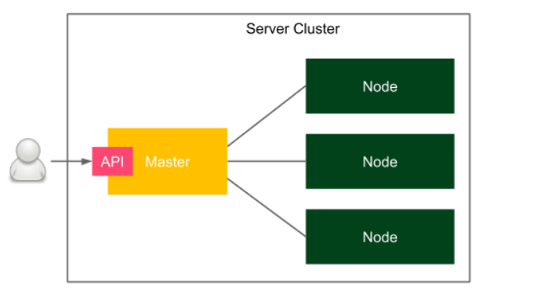
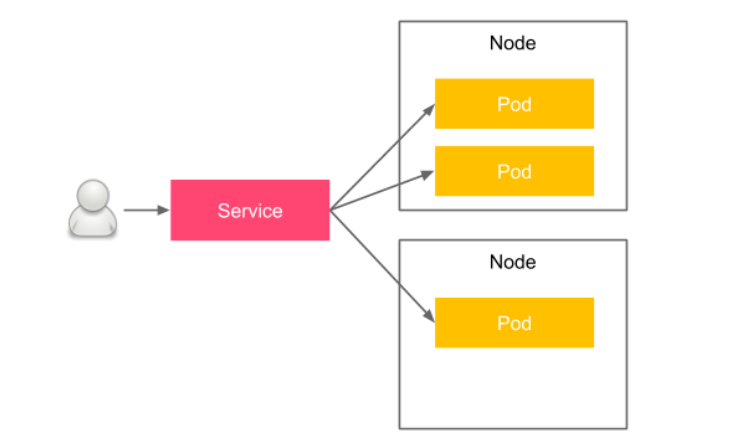

## Curso de desarrollo de software

**Indicaciones**

Inicia un repositorio llamado CC-3S2 y dentro una carpeta llamada Actividades. Dentro de esta escribe una carpeta llamada `Kubernetes` y coloca todas tus respuestas.

Esta actividad es individual.


### Introducción a la clustering de servidores  

Un clúster de servidores es un conjunto de computadoras conectadas que funcionan juntas de tal manera que se pueden usar de manera similar a un solo sistema. 
Los servidores suelen estar conectados a través de la red local mediante una conexión lo suficientemente rápida para garantizar que los servicios que se ejecutan se distribuyan. 

Un clúster de servidor simple se presenta en el siguiente diagrama:  



Un usuario accede al clúster a través de un host maestro, que expone la API del clúster. 

Existen múltiples nodos que actúan como recursos informáticos, lo que significa que son los encargados de ejecutar las aplicaciones.

El maestro, por otro lado, es responsable de todas las demás actividades, como el proceso de orquestación, el descubrimiento de servicios, el equilibrio de carga y la detección de fallas de nodos.  

### Introducción a Kubernetes 

[Kubernetes](https://kubernetes.io/es/) es un sistema de administración de clústeres de código abierto que fue diseñado originalmente por Google. 
La popularidad de Kubernetes ha crecido tanto recientemente que usar Kubernetes es el enfoque recomendado y mantener las herramientas nativas de Docker como alternativa. 

El siguiente gráfico muestra la arquitectura simplificada de Kubernetes: 


El plano de control de Kubernetes (maestro), que en realidad es un conjunto de servicios de clúster, es responsable de hacer cumplir el estado deseado de tus aplicaciones. 
En otras palabras, especifica la configuración de implementación de manera declarativa (cuatro réplicas de un servicio web que expone el puerto 8080) y el plano de control 
es responsable de que esto suceda. 

Un nodo de Kubernetes, por otro lado, es un trabajador. Puedes verlo simplemente como un host de docker con un proceso especial de Kubernetes (llamado kubelet) instalado.  

Desde la perspectiva del usuario, proporciona una configuración de implementación declarativa en forma de archivo YAML y la pasa al plano de control de Kubernetes a través de su API. 
Luego, el plano de control lee la configuración e instala la implementación. 

Kubernetes introduce el concepto de **Pod**, que representa una única unidad de implementación. El Pod contiene contenedores Docker, que se programan juntos. 
Si bien puedes colocar varios contenedores en un solo Pod, en escenarios reales, verás que la mayoría de los Pods contienen solo un contenedor Docker. 

Los pods se crean y eliminan dinámicamente según los cambios de requisitos que se expresan en las actualizaciones de configuración de YAML.  

#### Descripción general de las características de Kubernetes 

Kubernetes proporciona una serie de características interesantes. Repasemos los más importantes: 

- Equilibrio de contenedores
- Equilibrio de carga de tráfico
- Escalamiento horizontal dinámico
- Recuperación de fallas
- Actualizaciones continuas
- Orquestación de almacenamiento
- Detección de servicios
- Ejecutar en todas partes

### Instalación de Kubernetes  

Kubernetes, al igual que Docker, consta de dos partes: el cliente y el servidor. 

Obviamente, para hacer cualquier cosa con Kubernetes, necesitamos ambas partes, así que describámoslas una por una, comenzando con el cliente.  

#### Cliente de Kubernetes  

El cliente de Kubernetes, `kubectl`,  es una aplicación de línea de comandos que te permite realizar operaciones en el clúster de Kubernetes. 

El proceso de instalación depende de tu sistema operativo. 

Puedes consultar los detalles en el sitio web oficial de Kubernetes: https://kubernetes.io/docs/tasks/tools/. 

Una vez que haya instalado correctamente kubectl , deberías poder ejecutar el siguiente comando:  

```
$ kubectl version --client 
```

Ahora que tienes configurado el cliente de Kubernetes, podemos pasar al servidor.  

#### Servidor de Kubernetes 


Hay varias formas de configurar un servidor de Kubernetes. Si eres completamente nuevo en Kubernetes, se recomienda comenzar desde un entorno local.  

**Entorno local**  

Aunque Kubernetes en sí mismo es un sistema de clústeres complejo, existen algunas herramientas que pueden simplificar tu configuración de desarrollo local. Repasemos las opciones que tiene, que incluyen `Docker Desktop`, `kind` y `minikube`.  

**Docker Desktop**  

[Docker Desktop](https://www.docker.com/products/docker-desktop/), es una aplicación que se utiliza para configurar un entorno Docker local en macOS o Windows. 

Como se sabe, el demonio Docker solo puede ejecutarse de forma nativa en Linux, por lo que para otros sistemas operativos, se debe ejecutarlo en una máquina virtual.

Docker Desktop proporciona una forma súper intuitiva de hacer esto y, afortunadamente, también admite la creación de clústeres de Kubernetes. 

Si tienes instalado Docker Desktop, todo lo que necesitas hacer es marcar la casilla `Enable Kubernetes` en la interfaz de usuario.  

A partir de aquí, se iniciará el clúster de Kubernetes y se configurará kubectl y se estará listo para usar el clúster de Kubernetes.  

**Kind** 

Si usas el sistema operativo Linux y no puedes, o simplemente no quieres, usar Docker Desktop, entonces tu segunda opción más simple es [kind](https://kind.sigs.k8s.io/) (abreviatura de Kubernetes in Docker). Es una herramienta para la que el único requisito es tener Docker instalado y configurado.  

Después de instalar kind, puedes iniciar y configurar tu clúster local de Kubernetes con este único comando:  

```
$ kind create cluster 
```

**Nota:** Puedes consultar los pasos de instalación de kind en https://kind.sigs.k8s.io/docs/user/quick-start/.  

**minikube**  

[minikube](https://kubernetes.io/es/docs/tutorials/hello-minikube/), es una herramienta de línea de comandos que inicia un entorno de Kubernetes completamente funcional dentro de una máquina virtual. Está respaldado por un hipervisor de VM, por lo que debe tener instalado VirtualBox, Hyper-V, VMware o una herramienta similar. 

Las instrucciones para instalar minikube dependen de tu sistema operativo, y puedes encontrar instrucciones para cada uno en https://minikube.sigs.k8s.io/docs/start/.  

 minikube es una herramienta de código abierto que se puede encontrar en GitHub en https://github.com/kubernetes/minikube. 
 
 Una vez que haya instalado correctamente minikube, puedes iniciar tu clúster de Kubernetes con el siguiente comando:  

```
$ minikube start 
```
 
minikube inicia un clúster de Kubernetes y configura automáticamente el cliente de Kubernetes con la URL y las credenciales del clúster. 

#### Plataformas en la nube 

Kubernetes se ha vuelto tan popular que la mayoría de las plataformas de computación en la nube lo brindan como un servicio. 

[Google Cloud Platform](https://cloud.google.com/?hl=es-419) (GCP), que te permite crear un clúster de Kubernetes en unos minutos. Otras plataformas en la nube, como [Microsoft Azure](https://azure.microsoft.com/es-es), [Amazon Web](https://aws.amazon.com/es/) Services (AWS) e [IBM Cloud](https://cloud.ibm.com/login), también tienen Kubernetes . .  

Instalar Kubernetes desde cero en tus propios servidores tiene sentido si no quieres depender de plataformas en la nube o si las políticas de seguridad de tu empresa no lo permiten. 

El proceso de instalación es relativamente complejo y está fuera del alcance, pero puedes encontrar todos los detalles en la documentación oficial en https://kubernetes.io/docs/setup/production-environment/.  

 Ahora que tenemos configurado el entorno de Kubernetes, podemos verificar que kubectl está conectado al clúster correctamente y que estamos listos para comenzar a implementar las aplicaciones.  

#### Verificación de la configuración de Kubernetes  

Independientemente de la instalación del servidor de Kubernetes que elijas, ya deberías tener todo configurado y el cliente de Kubernetes debería estar completo con la URL y las credenciales del clúster. 

Puedes verificar esto con el siguiente comando:  

```
$ kubectl cluster-info 

Kubernetes control plane is running at https://kubernetes. 
docker.internal:6443 
CoreDNS is running at https://kubernetes.docker.internal:6443/ 
api/v1/namespaces/kube-system/services/kube-dns:dns/proxy 
```
 
Esta es la salida para el escenario de Docker Desktop y es por eso que puedes ver `localhost`. 

Tu salida puede ser ligeramente diferente y puede incluir más entradas. Si no ves errores, entonces todo está correcto y podemos comenzar a usar Kubernetes para ejecutar aplicaciones.  

### Uso de Kubernetes  

Tenemos todo el entorno de Kubernetes listo y kubectl configurado. Esto significa que ya es hora de presentar finalmente el poder de Kubernetes e implementar la primera aplicación. 


### Implementación de una aplicación  

Para empezar crea la imagen de Docker `checha/calculador` desde [calculador2](https://github.com/kapumota/Actividades/tree/main/calculador2) que debes configurar  a través de los siguientes comandos y comenzar con varias réplicas en Kubernetes.  

```
$ ./gradlew build
$ docker build -t calculador2 .
$ docker run -p 8080:8080 --name calculador2 calculador2
```

Usando los comandos anteriores, creamos la aplicación, creamos la imagen de Docker y ejecutamos el contenedor de Docker. Después de un tiempo, deberíamos poder abrir el navegador en `http://localhost:8080/sum?a=1&b=2` y ver 3 como resultado.


Para iniciar un contenedor Docker en Kubernetes, debemos preparar una configuración de implementación como un archivo YAML. Llamémoslo `deployment.yaml` : 

```
apiVersion: apps/v1 
kind: Deployment                  (1)
metadata: 
  name: calculador2-deployment    (2)
  labels: 
    app: calculador2 
spec: 
  replicas: 3                     (3)
  selector:                       (4)
    matchLabels: 
      app: calculador2 
  template:                       (5)
    metadata: 
      labels:                     (6)
        app: calculador2 
    spec: 
      containers: 
      - name: calculador2           (7)
        image: checha/calculador2   (8)
        ports:                      (9)
        - containerPort: 8080 
```
 

En esta configuración de YAML, debemos asegurarnos de lo siguiente:  

1. Hemos definido un recurso de Kubernetes del tipo `Deployment` de la versión de la API de Kubernetes `apps/v1`.
2. El nombre de implementación único es `calculador2-deployment`.
3. Hemos definido que debe haber exactamente 3 Pods iguales creados.
4. `selector` define cómo `Deployment` encuentra Pods para administrar, en este caso, solo por la etiqueta.
5. `template` define la especificación para cada Pod creado.
6. Cada Pod está etiquetado con `app:calculador2`.
7. Cada Pod contiene un contenedor Docker llamado calculador.
8. Se creó un contenedor Docker a partir de la imagen llamado `checha/calculador2`.
9. El Pod expone el puerto del contenedor 8080.  


Para instalar la implementación, ejecuta el siguiente comando:  

```
$ kubectl apply -f deployment.yaml  
```

Puedes verificar que se hayan creado los tres Pods, cada uno con un contenedor Docker: 

```
$ kubectl get pods 
```
Cada Pod ejecuta un contenedor Docker. 

Podemos verificar sus registros usando el siguiente comando:  

```
$ kubectl logs pods/calculador2-deployment-dccdf8756-h2l6c  
```
 
Debería ver el familiar logotipo de Spring y los registros del servicio web `Calculador2`.  

Para ver una descripción general de los comandos de kubectl, consulta la guía oficial: https://kubernetes.io/docs/reference/kubectl/overview/ .  

 ### Implementación de un servicio de Kubernetes  

Cada Pod tiene una dirección IP en la red interna de Kubernetes, lo que significa que ya puede acceder a cada instancia de calculador desde otro Pod que se ejecuta en el mismo clúster de Kubernetes. 

Pero, ¿cómo accedemos a la aplicación desde el exterior? Ese es el papel de un servicio (Services)  de Kubernetes. 

Veamos el siguiente diagrama, que presenta la idea de un Pod y un Servicio:  



 
Los pods se colocan físicamente en diferentes nodos, pero no tiene que preocuparse por esto, ya que Kubernetes se encarga de la orquestación correcta e introduce la abstracción de un Pod y un Servicio. 

El usuario accede a `Service`, cuya carga equilibra el tráfico entre las réplicas del Pod.  

Veamos un ejemplo de cómo crear un servicio para la aplicación `Calculador2`. 

Al igual que hicimos para la implementación, comenzamos desde un archivo de configuración YAML. Llamémoslo `service.yaml` : 

```
apiVersion: v1 
kind: Service 
metadata: 
  name: calculador2-service 
spec: 
  type: NodePort 
  selector: 
    app: calculador2 
  ports: 
  - port: 8080 
```

Esta es una configuración para un servicio simple que equilibra la carga del tráfico a todos los pods que cumplen con los criterios que mencionamos en el selector. 

Para instalar el servicio, ejecuta el siguiente comando: 

```
$ kubectl apply -f service.yaml 
```

Luego puedes verificar que el servicio se implementa correctamente ejecutando el siguiente comando:  

```
$ kubectl get service calculador2-service 
```

Para verificar que el servicio apunte a las tres réplicas de Pod que creamos en la sección anterior, ejecuta el siguiente comando:  

```
$ kubectl describe service calculador-service | grep Endpoints 
```
Las direcciones IP, tanto para Services como para el Pod, son internas a la red del clúster de Kubernetes.  


Para obtener más información sobre los servicios de Kubernetes, visita el sitio web oficial de Kubernetes en https://kubernetes.io/docs/concepts/services-networking/service/.  

### Exponiendo una aplicación  


Para comprender cómo se puede acceder a tu aplicación desde el exterior, debemos comenzar con los tipos de servicios de Kubernetes. 

Puedes utilizar cuatro tipos de servicio diferentes, de la siguiente manera:  

 - ClusterIP (predeterminado): el servicio solo tiene una IP interna.
 - NodePort: expone el servicio en el mismo puerto de cada nodo del clúster. En otras palabras, cada máquina física (que es un nodo de Kubernetes) abre un puerto que se reenvía al servicio. Luego, puedes acceder a él usando `<NODE-IP>:<NODE-PORT>`.
 - LoadBalancer: crea un balanceador de carga externo y asigna una IP externa separada para el servicio. Tu clúster de Kubernetes debe admitir balanceadores de carga externos, lo que funciona bien en el caso de las plataformas en la nube, pero es posible que no funcione si usas minikube.
 - ExternalName: Expone el servicio usando un nombre DNS (especificado por `externalName` en la especificación).  

Si quieres usar LoadBalancer que parece ser la solución más simple, tiene dos inconvenientes:  

- Primero, no siempre está disponible, por ejemplo, si se implementó Kubernetes en minikube.
- En segundo lugar, las direcciones IP públicas externas suelen ser caras. Una solución diferente es usar un servicio `NodePort`. 


Ahora, veamos cómo podemos acceder al servicio.  

Podemos repetir el mismo comando que ya ejecutamos: 

```
$ kubectl get service calculador2-service
NAME       TYPE     CLUSTER-IP   EXTERNAL-IP  PORT(S)
AGE
calculador2-service NodePort    10.19.248.154 <none>
8080:32259/TCP 13m
```
 
Puedes ver que se seleccionó el puerto 32259 como puerto de nodo. Esto quiere decir que podemos acceder al servicio `Calculador2` usando ese puerto y la IP de cualquiera de los nodos de Kubernetes.  

La dirección IP de tu nodo de Kubernetes depende de tu instalación. Si usas Docker Desktop, entonces tu IP de nodo es localhost . 

En el caso de minikube, puedes comprobarlo con el comando `minikube ip`. 

En el caso de las plataformas en la nube o la instalación local, puedes verificar las direcciones IP con el siguiente comando:  

```
$ kubectl get nodes -o jsonpath='{ $.items[*].status. addresses[?(@.type=="ExternalIP")].address }' 
```
 

Para verificar que puedes acceder a `Calculador2` desde el exterior, ejecuta el siguiente comando:  

```
$ curl <NODE-IP>:32047/sum?a=1\&b=2 
```
 
Hicimos una solicitud HTTP a una de las instancias de contenedor de `Calculador2` y devolvió la respuesta correcta, lo que significa que implementamos con éxito la aplicación en Kubernetes.  

El comando kubectl ofrece un atajo para crear un servicio sin usar YAML. En lugar de la configuración que usamos, podría ejecutar el siguiente comando: 

```
$ kubectl expose deployment calculador2-deployment --type=NodePort --name=calculador2-service  
```

### Ejercicios

1. Qué es un clúster de servidores?
2. ¿Cuál es la diferencia entre un plano de control de Kubernetes y un nodo de Kubernetes?
3. Nombra al menos tres plataformas en la nube que proporcionen un entorno de Kubernetes listo para usar.
4. Ejecuta una aplicación `hello world` en el clúster de Kubernetes
   - Implemente la aplicación con tres réplicas.
   - Exponga la aplicación con el servicio NodePort. 
   - Realiza una solicitud (usando curl) a la aplicación.

5. ¿Cuál es la diferencia entre una implementación y un servicio de Kubernetes?
6. Nombra al menos dos sistemas de administración de clústeres que no sean Kubernetes.
